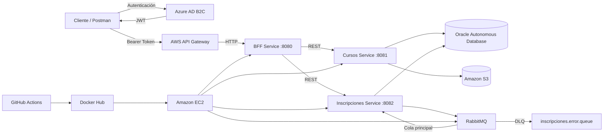

# Plataforma de Cursos Cloud Native

Proyecto desarrollado para la **Evaluación Final Transversal** de la asignatura **Desarrollo Cloud Native** de Duoc UC.

La solución implementa una plataforma de cursos en línea basada en microservicios, con autenticación y autorización mediante Azure AD B2C, administración de APIs con AWS API Gateway, persistencia en Oracle Autonomous Database, almacenamiento de archivos en Amazon S3, mensajería asíncrona con RabbitMQ y despliegue automatizado en Amazon EC2 mediante GitHub Actions.

## Integrantes

- Pedro Breit
- Javiera Mülchi

## Descripción general

La plataforma permite administrar cursos, materiales, inscripciones, exámenes y calificaciones mediante una arquitectura desacoplada compuesta por tres microservicios Spring Boot:

| Servicio | Puerto | Responsabilidad |
|---|---:|---|
| `bff-service` | `8080` | Punto de entrada del backend, seguridad JWT y orquestación de solicitudes. |
| `cursos-service` | `8081` | Gestión de cursos, archivos S3, exámenes y calificaciones. |
| `inscripciones-service` | `8082` | Gestión de inscripciones y procesamiento asíncrono con RabbitMQ. |

En producción, solamente el BFF publica el puerto `8080`. Los servicios internos se comunican mediante una red privada de Docker.

## Arquitectura



### Flujo principal

1. El usuario obtiene un token JWT desde Azure AD B2C.
2. La solicitud ingresa por AWS API Gateway.
3. API Gateway valida el JWT y redirige la petición al BFF.
4. El BFF aplica las reglas de autorización con Spring Security.
5. La operación se envía a `cursos-service` o `inscripciones-service`.
6. Los servicios utilizan Oracle, Amazon S3 o RabbitMQ según la funcionalidad solicitada.

## Tecnologías utilizadas

- Java 21
- Spring Boot
- Spring Security
- OAuth 2.0 Resource Server
- Spring Data JPA
- Spring AMQP
- Maven
- Docker y Docker Compose
- RabbitMQ
- Oracle Autonomous Database
- Amazon S3
- AWS API Gateway
- Amazon EC2
- Azure AD B2C
- GitHub Actions
- Docker Hub
- Postman

## Funcionalidades

### Rol ESTUDIANTE

- Consultar cursos activos.
- Consultar exámenes.
- Publicar solicitudes de inscripción.
- Listar sus inscripciones.
- Listar y descargar materiales.
- Responder exámenes.
- Consultar sus calificaciones.

### Rol INSTRUCTOR

- Crear, consultar, actualizar y desactivar cursos.
- Subir, listar, reemplazar, descargar y eliminar archivos.
- Crear, consultar, actualizar y desactivar exámenes.
- Consultar y ajustar calificaciones.
- Consumir manualmente mensajes almacenados en la cola de errores.

## Seguridad

La solución utiliza Azure AD B2C como proveedor de identidad. Los tokens JWT incluyen el rol del usuario mediante el atributo personalizado `extension_Rol`.

El BFF funciona como OAuth 2.0 Resource Server y aplica autorización según el método HTTP, la ruta solicitada y el rol autenticado.

Comportamientos validados:

| Escenario | Resultado |
|---|---|
| Solicitud sin token | `401 Unauthorized` |
| Estudiante intenta ejecutar una operación de instructor | `403 Forbidden` |
| Solicitud con token y rol autorizado | Operación ejecutada correctamente |

## RabbitMQ y procesamiento asíncrono

Las solicitudes de inscripción se publican en RabbitMQ para desacoplar la recepción de la solicitud de su procesamiento definitivo.

| Componente | Nombre |
|---|---|
| Exchange principal | `inscripciones.exchange` |
| Cola principal | `inscripciones.queue` |
| Routing key principal | `inscripciones.nueva` |
| Dead Letter Exchange | `inscripciones.dlx` |
| Cola de errores | `inscripciones.error.queue` |
| Routing key de error | `inscripciones.error` |

### Inscripción válida

1. El cliente envía una solicitud con `forzarError: false`.
2. La API responde inmediatamente con `EN_PROCESO`.
3. El consumidor procesa el mensaje.
4. La inscripción se persiste en Oracle con estado `CONFIRMADA`.

### Flujo de error

1. El cliente envía una solicitud con `forzarError: true`.
2. El consumidor genera una excepción controlada.
3. RabbitMQ redirige el mensaje hacia `inscripciones.error.queue`.
4. Un instructor puede consumir el mensaje mediante el endpoint manual de la DLQ.

## Amazon S3

Los materiales de los cursos se almacenan en el bucket configurado para la plataforma. Los objetos se organizan mediante el siguiente prefijo:

```text
cursos/{idCurso}/
```

Operaciones implementadas:

- Subir archivos.
- Listar archivos por curso.
- Reemplazar archivos.
- Descargar archivos.
- Eliminar archivos.

## Persistencia en Oracle

La información estructurada se almacena en Oracle Autonomous Database.

| Tabla | Propósito |
|---|---|
| `CURSOS` | Datos de cursos, instructor, cupo y estado. |
| `INSCRIPCIONES` | Inscripciones de estudiantes y estado de procesamiento. |
| `EXAMENES` | Exámenes asociados a los cursos. |
| `CALIFICACIONES` | Respuestas, puntajes y fechas de evaluación. |

Los scripts de creación y carga se encuentran en la carpeta `database/`.

## Estructura del repositorio

```text
DUOC-DCN-EFT/
├── .github/
│   └── workflows/
│       └── main.yml
├── bff-service/
│   ├── src/
│   ├── Dockerfile
│   └── pom.xml
├── cursos-service/
│   ├── src/
│   ├── Dockerfile
│   └── pom.xml
├── inscripciones-service/
│   ├── src/
│   ├── Dockerfile
│   └── pom.xml
├── database/
│   ├── 01_crear_tablas.sql
│   ├── 02_insertar_datos.sql
│   └── 03_crear_examenes_calificaciones.sql
├── documentacion/
├── frontend/
├── oracle/
├── rabbitmq/
├── docker-compose.prod.yml
└── README.md
```

Cada microservicio es un proyecto Maven independiente y posee su propio código fuente, pruebas y Dockerfile.

## Variables de entorno

Crear un archivo `.env` en el servidor o entorno de ejecución. No se deben publicar valores reales en el repositorio.

```dotenv
ORACLE_DB_USERNAME=
ORACLE_DB_PASSWORD=

RABBITMQ_USERNAME=
RABBITMQ_PASSWORD=

AWS_ACCESS_KEY_ID=
AWS_SECRET_ACCESS_KEY=
AWS_SESSION_TOKEN=

JWT_JWK_SET_URI=

IMAGE_TAG=latest
```

El wallet de Oracle debe mantenerse fuera del control de versiones y montarse en modo de solo lectura dentro de los contenedores que utilizan la base de datos.

Ruta utilizada en el despliegue:

```text
/opt/plataforma-cursos/oracle/wallet
```

## Ejecución de pruebas

Desde la raíz del repositorio:

```bash
cd bff-service
./mvnw test

cd ../cursos-service
./mvnw test

cd ../inscripciones-service
./mvnw test
```

En Windows se puede utilizar `mvnw.cmd` en lugar de `./mvnw`.

## Ejecución con Docker Compose

El archivo `docker-compose.prod.yml` utiliza las imágenes publicadas en Docker Hub.

```bash
docker compose \
  --env-file .env \
  -f docker-compose.prod.yml \
  pull
```

```bash
docker compose \
  --env-file .env \
  -f docker-compose.prod.yml \
  up -d
```

Consultar el estado:

```bash
docker compose \
  --env-file .env \
  -f docker-compose.prod.yml \
  ps
```

Detener los contenedores:

```bash
docker compose \
  --env-file .env \
  -f docker-compose.prod.yml \
  down
```

Contenedores esperados:

```text
plataforma-bff-service
plataforma-cursos-service
plataforma-inscripciones-service
plataforma-rabbitmq
```

## Imágenes Docker

- `pedrobreit/plataforma-bff`
- `pedrobreit/plataforma-cursos`
- `pedrobreit/plataforma-inscripciones`
- `rabbitmq:3-management`

## Catálogo de endpoints

Ruta base:

```text
/api/plataforma
```

### Cursos

| Método | Ruta | Rol | Descripción |
|---|---|---|---|
| `GET` | `/cursos` | Ambos | Listar cursos activos. |
| `POST` | `/cursos` | INSTRUCTOR | Crear un curso. |
| `GET` | `/cursos/{idCurso}` | Ambos | Consultar un curso. |
| `PUT` | `/cursos/{idCurso}` | INSTRUCTOR | Actualizar un curso. |
| `DELETE` | `/cursos/{idCurso}` | INSTRUCTOR | Desactivar un curso. |

### Archivos

| Método | Ruta | Rol | Descripción |
|---|---|---|---|
| `POST` | `/cursos/{idCurso}/archivos` | INSTRUCTOR | Subir un archivo. |
| `GET` | `/cursos/{idCurso}/archivos` | Ambos | Listar archivos del curso. |
| `PUT` | `/cursos/{idCurso}/archivos?key={key}` | INSTRUCTOR | Reemplazar un archivo. |
| `DELETE` | `/cursos/{idCurso}/archivos?key={key}` | INSTRUCTOR | Eliminar un archivo. |
| `GET` | `/archivos?key={key}` | Ambos | Descargar un archivo. |

### Inscripciones

| Método | Ruta | Rol | Descripción |
|---|---|---|---|
| `GET` | `/inscripciones` | ESTUDIANTE | Listar inscripciones. |
| `POST` | `/inscripciones` | ESTUDIANTE | Publicar una solicitud en RabbitMQ. |
| `POST` | `/inscripciones/mensajes/errores/consumir` | INSTRUCTOR | Consumir un mensaje desde la DLQ. |

Ejemplo de solicitud:

```json
{
  "idEstudiante": 9001,
  "nombreEstudiante": "Estudiante Demo",
  "correoEstudiante": "estudiante@demo.com",
  "idCurso": 5,
  "forzarError": false
}
```

### Exámenes

| Método | Ruta | Rol | Descripción |
|---|---|---|---|
| `GET` | `/cursos/{idCurso}/examenes` | Ambos | Listar exámenes del curso. |
| `POST` | `/cursos/{idCurso}/examenes` | INSTRUCTOR | Crear un examen. |
| `GET` | `/examenes/{idExamen}` | Ambos | Consultar un examen. |
| `PUT` | `/examenes/{idExamen}` | INSTRUCTOR | Actualizar un examen. |
| `DELETE` | `/examenes/{idExamen}` | INSTRUCTOR | Desactivar un examen. |
| `POST` | `/examenes/{idExamen}/respuestas` | ESTUDIANTE | Responder un examen. |

### Calificaciones

| Método | Ruta | Rol | Descripción |
|---|---|---|---|
| `GET` | `/calificaciones/estudiantes/{idEstudiante}` | ESTUDIANTE | Consultar calificaciones. |
| `GET` | `/cursos/{idCurso}/calificaciones` | INSTRUCTOR | Consultar notas del curso. |
| `PUT` | `/calificaciones/{idCalificacion}` | INSTRUCTOR | Modificar un puntaje. |

## CI/CD

El workflow ubicado en `.github/workflows/main.yml` se ejecuta con cambios en la rama principal.

El pipeline realiza las siguientes tareas:

1. Ejecuta las pruebas Maven de los tres microservicios.
2. Construye imágenes Docker para arquitectura `linux/amd64`.
3. Publica las imágenes en Docker Hub.
4. Reconstruye y valida el wallet de Oracle desde un secreto codificado.
5. Transfiere la configuración requerida a Amazon EC2.
6. Descarga las nuevas imágenes.
7. Actualiza los contenedores mediante Docker Compose.
8. Valida el inicio del BFF y su protección mediante una respuesta `401`.
9. Elimina archivos temporales y revoca el acceso SSH utilizado durante el despliegue.

## Despliegue

La solución se ejecuta en una instancia Amazon EC2 mediante los siguientes componentes:

- BFF en el puerto público `8080`.
- `cursos-service` en el puerto interno `8081`.
- `inscripciones-service` en el puerto interno `8082`.
- RabbitMQ en el puerto interno `5672`.
- RabbitMQ Management en el puerto `15672`.

La API pública se expone a través de AWS API Gateway.

## Validación funcional

Las pruebas fueron realizadas con Postman y contemplan:

- Autenticación y autorización.
- CRUD de cursos.
- Gestión completa de archivos en Amazon S3.
- Inscripción válida procesada mediante RabbitMQ.
- Redirección de errores hacia una DLQ.
- Consumo manual de mensajes fallidos.
- Creación y respuesta de exámenes.
- Consulta y actualización de calificaciones.
- Desactivación lógica de cursos y exámenes.

## Consideraciones de seguridad

- No publicar archivos `.env`.
- No publicar el wallet de Oracle.
- No almacenar tokens JWT en el repositorio.
- No exponer claves de AWS, contraseñas de RabbitMQ ni credenciales de Oracle.
- Restringir los puertos administrativos mediante reglas de Security Group.
- Mantener las variables sensibles en GitHub Actions Secrets.

## Documentación

La documentación técnica y las evidencias de la evaluación se encuentran en la carpeta `documentacion/`.

## Uso académico

Este repositorio fue desarrollado con fines académicos para la Evaluación Final Transversal de la asignatura Desarrollo Cloud Native.